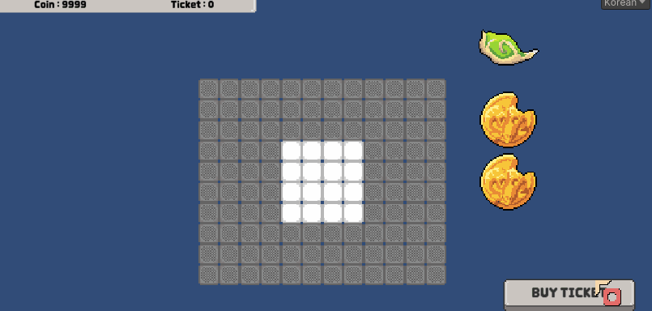
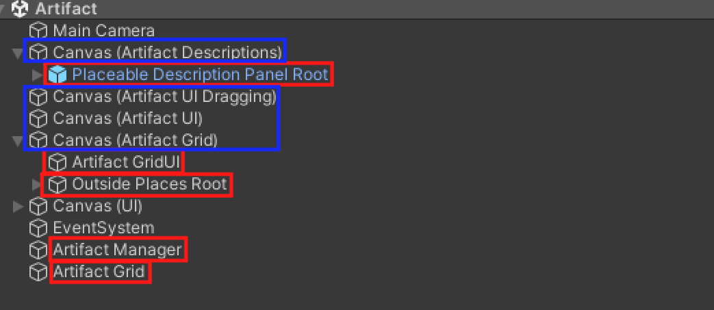
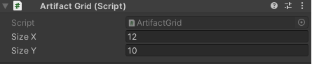
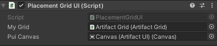
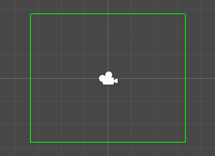
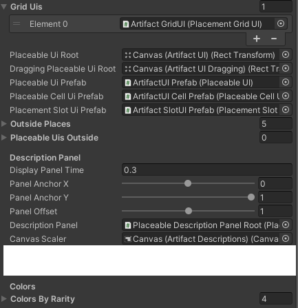

# 유니티의 인벤토리 UI 프레임워크

## 기능
- 원하는 가로/세로 크기의 인벤토리의 UI 생성
- 인벤토리에 배치될 아이템의 UI 생성
- 드래그/클릭으로 아이템의 이동과 회전, 장착과 해제 손쉽게 관리
- 아이템의 설명과 애니메이션

## 주의사항
- 부드러운 애니메이팅을 위해 DOTween을 사용하므로 사용할 프로젝트가 DOTween을 Import해야 함.
##

## 사용 방법

### 1. 사용할 유니티 프로젝트에 현재 폴더 복사.
### 2. Abstract Class들을 상속하는 클래스 작성
    총 3개의 클래스 작성 (각각 IPlaceable, PlaceManager, PlacementGrid 상속)
    설명을 위해 작성한 클래스들의 이름을 예시와 같이 각각 Artifact, ArtifactManager, ArtifactGrid라고 칭함.

### 3. 프리팹 생성. 
    총 4개를 생성해야 함.  (Placeable Prefab, SlotUI Prefab, Cell Prefab, PlaceableUI Prefab)
    Placeable Description Panel의 경우 이 에셋의 Prefabs 폴더 내 프리팹을 사용하면 됨.

### 4. 씬 구성

    씬 구성 예시. 푸른색 표시는 캔버스 설정으로, 원한다면 바꿔도 됨.
    하지만 예시와 같이 사용하는 걸 추천 (위쪽의 캔버스일수록 더 높은 Sorting Order를 가지게 설정)

    붉은 표시의 오브젝트 중 Artifact Manager와 Artifact Grid는 어디에 위치하든 상관없지만, 
    나머지는 모두 RectTransform을 가지기 때문에 Canvas 내에 존재해야 한다.

  

    Grid 오브젝트는 가로와 세로의 크기를 지정해준다.

    GridUI 오브젝트는 Grid와, PlaceableUI (예제에선 ArtifactUI)가 위치할 캔버스를 지정해준다.
    이때, Scene 창에 초록색 기즈모가 나타나 게임에서 보일 GridUI의 전체 크기를 표시한다.

    이후 Placemanager (예제에선 ArtifcatManager)의 설정을 마치면 완료.
    'Description Panel' 부분 변수들은 설명창이 어떻게 표시되는지를 설정하는 변수들이다.

### 5. 완료!
    여기까지 완료했다면, 이후는 자신만의 게임을 만들어나가면 된다.
    예를 들면, Placement를 상속한 클래스에서 OnChanged 이벤트를 이용해 볼 수 있겠다.
